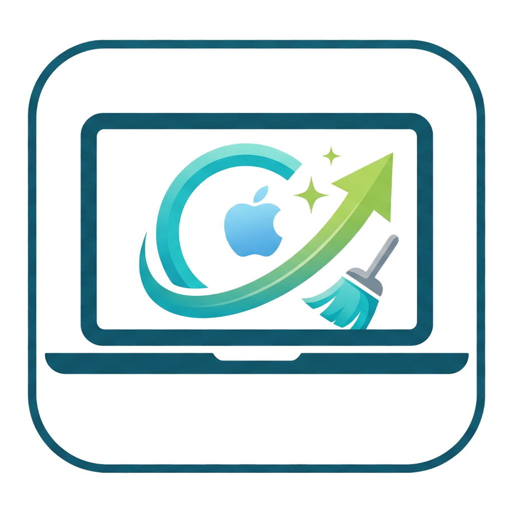
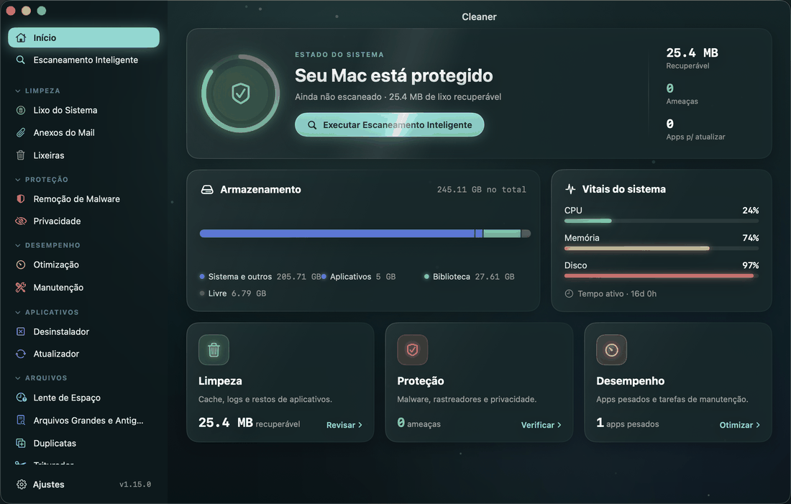
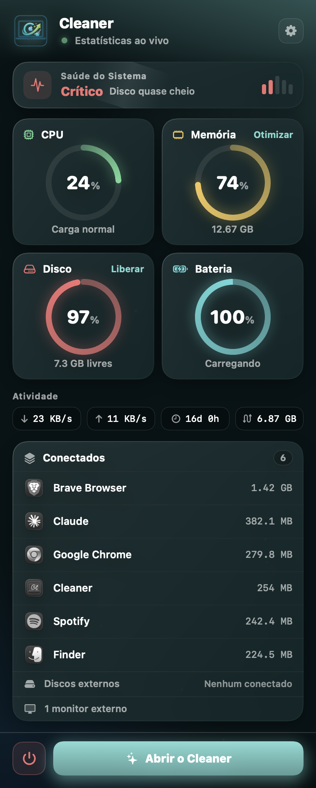

<p align="center">
  
</p>

<h1 align="center">Cleaner</h1>

<p align="center">
  <strong>O limpador, otimizador e antimalware open-source para macOS — com interface 100% em Português do Brasil.</strong><br>
  Completo e gratuito, feito em Swift 6 e SwiftUI.
</p>

<p align="center">
  <sub>🇧🇷 <strong>Cleaner</strong> é um fork com a interface totalmente traduzida para o Português do Brasil, baseado no projeto
  open-source <a href="https://github.com/iliyami/MacSai">iliyami/MacSai</a> (licença BSD 3-Clause). O idioma pode ser
  trocado em <em>Ajustes → Idioma da Interface</em>.</sub>
</p>

<p align="center">
  <a href="https://github.com/editzffaleta/Cleaner/stargazers"></a>
  
  
  
  
  
</p>

<p align="center">
  
</p>

---

## O que é o Cleaner?

O **Cleaner** é um app **gratuito e de código aberto** para macOS que limpa arquivos de lixo, remove malware, otimiza o desempenho, desinstala apps por completo e visualiza o uso do disco — tudo em uma única interface, bonita e simples. É totalmente transparente e mantido pela comunidade.

**Sem assinaturas. Sem telemetria. Sem anúncios. Só um Mac limpo.**

Toda a interface está em **Português do Brasil**. Você pode trocar o idioma quando quiser em **Ajustes → Idioma da Interface**; por padrão, o app segue o idioma do sistema.

## Recursos

### Limpeza
| Módulo | Descrição |
|--------|-----------|
| **Escaneamento Inteligente** | Escaneamento com um clique que combina limpeza, proteção e análise de desempenho, com progresso ao vivo em 13 módulos |
| **Lixo do Sistema** | 16 categorias de escaneamento — caches de usuário/sistema, logs, arquivos de idioma, preferências corrompidas, itens de início quebrados, versões de documentos, backups de iOS, lixo do Xcode, **redução de Binários Universais** (detecta binários Mach-O "gordos" com fatias arm64 e x86_64 e os reescreve para a sua arquitetura nativa via `lipo`), usuários excluídos e muito mais |
| **Anexos do Mail** | Encontra anexos em cache do Apple Mail, Outlook e Spark |
| **Lixeiras** | Esvazia a Lixeira de todos os locais, inclusive de discos externos |

### Proteção
| Módulo | Descrição |
|--------|-----------|
| **Remoção de Malware** | Escaneamento por assinatura em 3 níveis (Rápido / Balanceado / Profundo), verifica launch agents/daemons, extensões de navegador e padrões de malware conhecidos |
| **Privacidade** | Limpa dados do Safari, Chrome e Firefox — histórico, cookies e cache. Limpeza de rastros do sistema com filtros por período |

### Desempenho
| Módulo | Descrição |
|--------|-----------|
| **Otimização** | Gerencia itens de início e launch agents com botões para ativar/desativar |
| **Manutenção** | 10 tarefas do sistema — liberar RAM, executar scripts de manutenção, reparar permissões, reconstruir o Launch Services, reindexar o Spotlight, limpar o cache DNS, reduzir snapshots do Time Machine. As tarefas são marcadas por severidade (segura / disruptiva); "Executar Tudo" exige confirmação explícita, e tarefas demoradas podem ser canceladas no meio |

### Aplicativos
| Módulo | Descrição |
|--------|-----------|
| **Desinstalador** | Motor de correspondência em 10 níveis que encontra todos os arquivos associados a um app em mais de 17 subpastas da Library. Remoção completa, redefinição de app e detecção de apps não usados |
| **Atualizador** | Verifica atualizações disponíveis dos apps instalados via feeds appcast do Sparkle |

### Arquivos
| Módulo | Descrição |
|--------|-----------|
| **Lente de Espaço** | Visualização em treemap do uso do disco, com navegação por níveis |
| **Arquivos Grandes e Antigos** | Encontra arquivos maiores que 50 MB, ordenados por tamanho e data do último acesso |
| **Duplicatas** | Detecção progressiva — agrupamento por tamanho → SHA-256 parcial (4 KB) → hash completo → verificação por inode |
| **Triturador** | Apagamento seguro de arquivos, com modos padrão, permanente e de sobrescrita segura |

### Widget na Barra de Menus

<p align="center">
  
</p>

Um widget com efeito de vidro (glassmorphism) na barra de menus que deixa os sinais vitais do seu Mac a um clique de distância — um processo independente que abre no login e é ligado/desligado pela barra lateral do app.

- **Anéis de estatísticas ao vivo** — carga da CPU, pressão de memória, uso do disco e bateria em uma grade 2×2 de anéis, com cores graduadas de verde → âmbar → vermelho
- **Rede, tempo ativo e swap** — vazão de download/upload em tempo real, tempo ativo do sistema e uso de swap
- **Recomendações** — dicas práticas e dispensáveis ("Os caches do usuário cresceram para 2,52 GB — execute o Lixo do Sistema"), com ações de um toque, silenciadas por 30 dias quando dispensadas
- **Status de proteção** — hora do último escaneamento de malware e contagem de ameaças, com cores por atualidade
- **Dispositivos conectados** — volumes externos (com espaço livre) e telas externas de relance
- **Alertas de saúde** — notificações em segundo plano quando o disco fica criticamente cheio ou a pressão de memória se mantém alta (com limite de frequência, opcional)
- **Um clique para o app** — vá direto para o Cleaner

## Arquitetura

```
Cleaner
├── MacClean          — App principal em SwiftUI (14 módulos, 15 telas)
├── MacCleanKit       — Framework compartilhado (modelos, constantes, protocolos)
├── MacCleanHelper    — Helper privilegiado via XPC (LaunchDaemon para operações de root)
└── MacCleanMenu      — Monitor na barra de menus (processo independente)
```

> Observação: os nomes internos dos alvos (targets) permanecem como `MacClean*` do projeto original — apenas a interface e a documentação foram traduzidas.

### Tecnologias

| Camada | Tecnologia |
|--------|-----------|
| Linguagem | Swift 6 com concorrência estrita |
| Interface | Híbrido SwiftUI + AppKit |
| Concorrência | Actors, TaskGroup, async/await, @Sendable |
| Banco de dados | GRDB.swift (SQLite) em modo WAL |
| Escaneamento de arquivos | Pré-carregamento de URLResourceKey no APFS |
| Atualizações incrementais | FSEvents com reprodução de histórico |
| Operações privilegiadas | SMAppService + NSXPCConnection |
| Estatísticas do sistema | APIs Mach (host_processor_info, vm_statistics64, proc_pidinfo) |

### Modelo de Segurança

O Cleaner foi projetado para **nunca causar perda de dados**:

- **Lista de bloqueio de caminhos protegidos** — `/System`, `/usr`, `/bin`, `/sbin` e os apps de sistema da Apple são intocáveis
- **Canonicalização de firmlinks do macOS** — `/var`↔`/private/var`, `/tmp`↔`/private/tmp`, `/etc`↔`/private/etc` resolvidos a uma única forma canônica, para que a detecção de redirecionamento por symlink não gere falso positivo em caminhos legítimos do sistema
- **Filtro de "limpabilidade" pré-escaneamento** — itens que o processo atual não conseguiria mover para a Lixeira (filhos de caches do sistema pertencentes ao root, diretórios protegidos pelo macOS em `~/Library/Caches/com.apple.*`) são descartados já no escaneamento, para nunca aparecerem na interface como limpáveis
- **Exclusão via Lixeira primeiro** — por padrão, todas as remoções vão para a Lixeira
- **Modo de simulação (dry-run)** — pré-visualize o que seria excluído sem tocar em nada
- **Prevenção de TOCTOU** — symlinks são resolvidos novamente imediatamente antes da exclusão
- **Limpeza em blocos** — seleções grandes (50 mil+) abrem uma confirmação; o motor divide o trabalho em blocos de 5 mil itens, respeitando `Task.isCancelled` entre eles, então o cancelamento é responsivo
- **Contabilidade recursiva de bytes** — o tamanho dos diretórios é percorrido de verdade, então o número de "X liberados" na tela final reflete a realidade
- **Política de segurança para órfãos** — a limpeza de órfãos é restrita apenas a caches/logs
- **Visualizador de registro de atividades no app** — todo erro durante a limpeza é registrado com o caminho completo; a tela pós-limpeza tem um botão "Ver Registro" que abre uma folha interna com filtro de "somente erros" e cópia para a área de transferência
- **Portão de privilégio XPC imposto pelo kernel** — o helper privilegiado usa `NSXPCListener.setCodeSigningRequirement` (macOS 13+), então o próprio kernel rejeita conexões de qualquer processo cuja assinatura de código não corresponda ao identificador e à equipe do app principal

## Instalação

> O Cleaner é distribuído como **código-fonte** (fork de tradução). Para usar a versão em português, compile o app a partir deste repositório, como abaixo. O projeto original (em inglês) oferece instalação via Homebrew e DMG notarizado — veja [iliyami/MacSai](https://github.com/iliyami/MacSai).

### Compilar a partir do código-fonte

Requisitos: macOS 14+ e o toolchain do Swift 6 (Xcode 16 ou superior).

```bash
git clone https://github.com/editzffaleta/Cleaner.git
cd Cleaner
swift build
swift test                     # executa 486 testes
./scripts/dev-install.sh       # compila, instala em /Applications e abre o app
```

O `dev-install.sh` gera uma versão nativa assinada localmente (ad-hoc), instala em `/Applications/Mac Sai.app` e abre o app já em português.

### Conceder Acesso Total ao Disco

Alguns módulos (Anexos do Mail, Privacidade, Malware) precisam de Acesso Total ao Disco para escanear áreas protegidas:

1. Abra **Ajustes do Sistema → Privacidade e Segurança → Acesso Total ao Disco**
2. Clique em **+** e adicione o app a partir da pasta Aplicativos
3. Reinicie o app

### Desinstalar

Para remover o app e todos os seus arquivos de suporte:

```bash
./scripts/uninstall.sh
```

Isso remove o app junto com preferências, caches, logs e banco de dados em `~/Library`. Se sobrar uma entrada em **Ajustes do Sistema → Geral → Itens de Início**, remova-a por lá; o macOS a limpa assim que o app é apagado.

## Requisitos

- macOS 14 (Sonoma) ou posterior
- Para compilar a partir do código-fonte: toolchain do Swift 6 (Xcode 16+)

## Estrutura do Projeto

```
Sources/
├── MacClean/
│   ├── App/                    # Ponto de entrada do app, estado, tela de conteúdo
│   ├── Core/
│   │   ├── Scanner/            # FileTreeScanner, TargetedScanner, ScanCoordinator
│   │   ├── Cleaner/            # CleaningEngine, SafetyGuard
│   │   ├── Cache/              # Camada de banco de dados GRDB
│   │   └── FSMonitor/          # Observador incremental com FSEvents
│   ├── Modules/                # 13 módulos de escaneamento
│   │   ├── SystemJunk/         # 16 categorias de lixo
│   │   ├── Malware/            # Escâner por assinatura + monitor em tempo real
│   │   ├── Uninstaller/        # Motor de correspondência de apps em 10 níveis
│   │   ├── SpaceLens/          # Algoritmo de treemap "squarified"
│   │   ├── Duplicates/         # Pipeline progressivo de hash
│   │   └── ...
│   ├── Views/                  # Telas SwiftUI (14 telas de módulo + componentes compartilhados)
│   ├── ViewModels/             # View models @Observable
│   ├── Services/               # PermissionManager, XPCClient
│   └── Utilities/              # Forma SuperEllipse, extensões
├── MacCleanKit/                # Modelos, constantes e protocolos compartilhados
├── MacCleanHelper/             # Helper privilegiado via XPC (operações de root)
└── MacCleanMenu/               # Monitor do sistema na barra de menus

Tests/                          # Suíte XCTest — 486 testes
├── MacCleanTests/              # testes do alvo do app
├── MacCleanKitTests/           # testes do framework
└── MacCleanTestSupport/        # fixtures (withTempHome, withFakeApp, …)
```

## Testes

```bash
swift test
```

Suíte baseada em XCTest cobrindo, entre outros:

- **`SafetyGuard`** — 24 testes adversariais (symlinks, travessia de diretórios, bytes NULL, SIP, apps protegidos, limites de arquivos, idempotência)
- **`CleaningEngine`** — 9 testes de integração (dry-run, lixeira, permanente, tratamento de erros, registro de operações)
- **Todas as 16 categorias de lixo do sistema** — declarações de alvo + a lógica de filtro
- **`SquarifiedTreemap`**, **`AppMatching`** (os 10 níveis do desinstalador), **`DuplicateDetection`**, **`MalwareSignatures`**, **`MaintenanceTask`** e muito mais
- **Ponta a ponta** — fixture sintética → escaneamento → resultados → ciclo de limpeza

A infraestrutura de testes (`Tests/MacCleanTestSupport/`) fornece `withTempHome`, `withFakeApp`, `withFakePlist` e outros ajudantes, para que os testes sejam determinísticos e nunca toquem na pasta pessoal real do usuário.

Meta de cobertura: **85%+ no geral**, **100% em `SafetyGuard` e `CleaningEngine`** (os arquivos críticos).

## Segurança

O Cleaner leva segurança a sério:

- **Sem telemetria ou analytics.** A única chamada de rede é uma verificação de atualização opcional (uma requisição à API de Releases do GitHub), que pode ser desativada nos Ajustes
- **Sem privilégios elevados por padrão** — o helper XPC só é ativado para tarefas de manutenção
- **Verificação de assinatura de código** — o helper XPC valida a identidade de quem o chama
- **Caminhos protegidos** — mais de 27 apps de sistema da Apple e todos os caminhos protegidos por SIP estão na lista de bloqueio
- **Código aberto** — cada linha de código pode ser auditada

Veja a [política de segurança](SECURITY.md) para saber como relatar uma vulnerabilidade.

## Contribuindo

Contribuições são bem-vindas! Leia as [Diretrizes de Contribuição](CONTRIBUTING.md) antes de enviar um Pull Request.

### Início Rápido

1. Faça um fork do repositório
2. Crie um branch de funcionalidade (`git checkout -b feature/minha-melhoria`)
3. Faça suas alterações
4. Rode os testes (`swift test`)
5. Faça o commit (`git commit -m 'Adiciona minha melhoria'`)
6. Envie (`git push origin feature/minha-melhoria`)
7. Abra um Pull Request

## Licença

Este projeto está licenciado sob a **Licença BSD 3-Clause** — veja o arquivo [LICENSE](LICENSE) para os detalhes.

Isso significa que você pode usar, modificar e redistribuir este código, mas **precisa**:
- Incluir o aviso de copyright original
- Incluir o texto da licença
- **Não** usar o nome do detentor do copyright nem os nomes dos contribuidores para promover produtos derivados sem permissão

## Créditos

O Cleaner é um fork de tradução do projeto **[iliyami/MacSai](https://github.com/iliyami/MacSai)**. Todo o crédito pelo app original vai para o autor e os contribuidores do MacSai.

Inspirado pela comunidade open-source de utilitários para Mac:
- [Pearcleaner](https://github.com/alienator88/Pearcleaner) — padrões de desinstalação de apps
- [Mole](https://github.com/tw93/Mole) — categorias de limpeza
- [Tencent Lemon Cleaner](https://github.com/Tencent/lemon-cleaner) — arquitetura modular
- Algoritmo Squarified Treemap por Bruls, Huizing & van Wijk (2000)

---

<p align="center">
  <strong>O Cleaner é software livre, feito pela comunidade, para a comunidade.</strong><br>
  Se ele foi útil para você, deixe uma ⭐ e compartilhe com outras pessoas.
</p>
